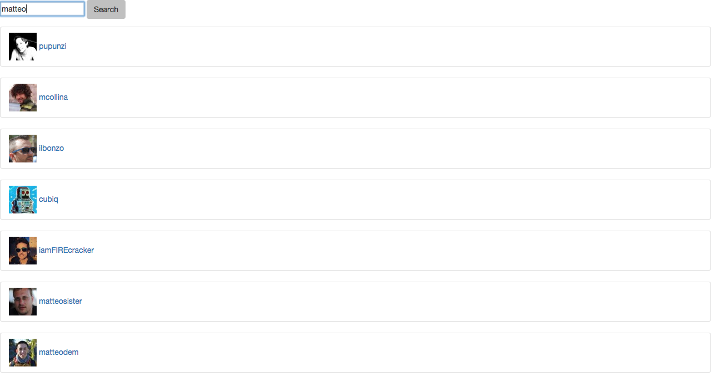

# Angular GitHub API

## What is it?
My fist Angular app. Search GitHub users by username.



##Technologies
| Front End   | Testing      |
| ------------|------------- |
| AngularJS   | Karma        |
| HTML & CSS  |              |
| jQuery      |              |

## How to run it
Clone the repository
```
SSH:
$ git clone git@github.com:matteomanzo/Angular-GitHubAPI-search.git
HTTPS:
$ git clone https://github.com/matteomanzo/Angular-GitHubAPI-search.git
```
Change into the directory
```
$ cd Angular-GitHubAPI-search
```
Run all the tests
```
karma start test/karma.conf.js
```
Run it locally typing `open index.html`.
